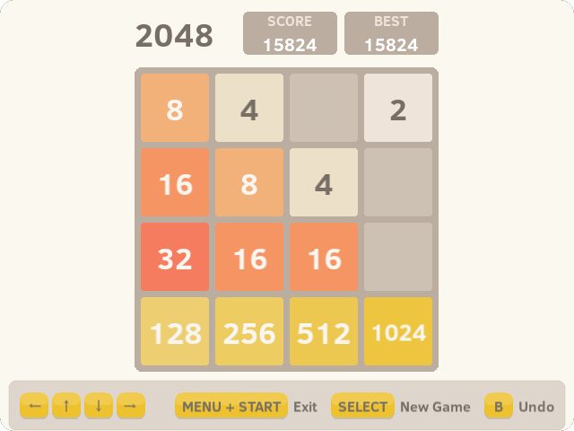

# 2048 for muOS

<p align="center">
  
</p>

A faithful port of the classic puzzle game 2048 for muOS, built using the LÖVE framework.

This project is a direct port of the popular open-source [2048 Android](https://github.com/tpcstld/2048) application by tpcstld, which itself is based on the original web game by Gabriele Cirulli.

## Features

- **Classic Gameplay**: The original 2048 puzzle experience optimized for handhelds.
- **Auto-Save & Resume**: Your progress, board state, and score are saved automatically after every move. Close the game anytime and pick up right where you left off.
- **Undo System**: Made a mistake? Press `B` to undo your previous move.
- **High Scores**: Automatically tracks and preserves your best score.
- **Accurate Aesthetics**: Uses the exact color palette, typography, and smooth slide/merge animations from the beloved Android version.
- **Standalone Package**: Bundled as a standard `.muxapp` package for effortless installation on muOS with dynamic UI scaling for different resolutions.

## Installation on muOS

1. Download the latest release `.muxapp` file.
2. Move the downloaded file to the `/mnt/mmc/MUOS/ARCHIVE` folder on your SD card.
3. Open Archive Manager on your device and select the file to install.
4. After installation, you'll find an entry called "2048" in the Applications section.

## Controls

- **D-Pad**: Swipe tiles Up, Down, Left, or Right
- **B**: Undo previous move
- **A**: Confirm / Continue
- **Select**: Restart game
- **Menu + Start**: Exit the game safely

*Note: Your progress is automatically saved after every move. You can safely close the game and pick up exactly where you left off.*

## Building from Source

To build the package yourself, you should be on a Linux or macOS environment with `bash` and `zip` installed. 

1. Clone this repository:
   ```bash
   git clone https://github.com/saitamasahil/2048-muos.git
   cd 2048-muos
   ```

2. Make sure the build script is executable:
   ```bash
   chmod +x build.sh
   ```

3. Run the build script:
   ```bash
   ./build.sh
   ```

4. The script will bundle the Lua source, the embedded LÖVE runtime, and all assets into a new `.muxapp` file located in the `build/` directory.

## Credits & Acknowledgements

- **Original Web Game**: [Gabriele Cirulli](https://github.com/gabrielecirulli/2048)
- **Android Port Reference**: [tpcstld - 2048](https://github.com/tpcstld/2048)
- Built using the [LÖVE Framework](https://love2d.org/).
